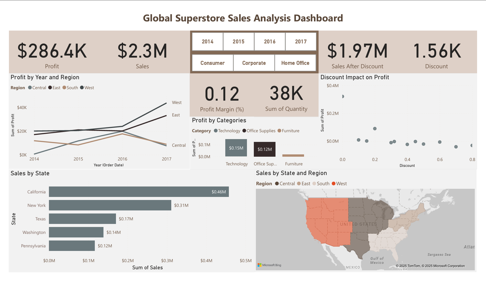

# Global-Superstore-Sales-Analysis-Dashboard
This project showcases my ability to use Power BI to transform raw sales data into meaningful business insights. Using the Global Superstore dataset, I analyzed global sales, profit, and customer trends across regions, product categories, and customer segments to identify key performance patterns and opportunities for business growth.

### Transform Data
There was minimal transformation required for the raw dataset.  
I performed basic cleaning and added a few calculated columns in **Power Query** for better analysis and visualization.

**New Columns Added:**
- **Year (Order Date):** To analyze yearly sales and profit trends  
  ```DAX
  Year = Date.Year([Order Date])
- **Month (Order Date):** To observe seasonal and monthly performance
  ```DAX
  Month = Date.monthname([Order Date])
- **Sales After Discount:** To evaluate the effect of discounts on total revenue
  ```DAX
  Sales After Discount = [Sales] * (1-[discount])
- **Profit Margin:** To measure profitability across categories and regions  
  ```DAX
  Profit Margin = [Profit] / [Sales]
    
These transformations ensure the dataset is structured for accurate time-series and profitability analysis.

# The Dashboard


## Insights & Analysis

**1. Sales & Profit Trends**
- Overall profit shows steady growth from **2014 to 2017**, driven mainly by the **West region**.
- Despite consistent sales across regions, **profitability varies significantly**, with some states showing strong revenue but low margins.

**2. Regional Performance**
- **California** and **New York** contribute the highest sales and profits.
- The **Central region** struggles with lower profit margins despite moderate sales volume.

**3. Category Insights**
- **Technology** delivers the highest profit margin.
- **Furniture** underperforms, with discounts heavily impacting profit.
- **Office Supplies** show balanced growth and stable margins.

**4. Discount Impact**
- The **scatter chart** reveals a **negative correlation** between discounts and profit.
- Higher discounts boost short-term sales but reduce long-term profitability.

**5. Customer Segments**
- **Consumer segment** generates the most sales, while **Corporate** orders have higher average order value but slimmer margins.

## Conclusion & Recommendations

Based on the analysis, the following recommendations are proposed:

- **Optimize Discount Strategy:** High discount rates reduce profit margins. Implement tiered discount rules based on customer segments or categories.
- **Focus on Profitable Regions:** Continue investing in the **West** region’s product mix, while addressing cost inefficiencies in the **Central** region.
- **Category Review:** Reassess pricing and marketing strategies for **Furniture** products to improve profitability.
- **Data-Driven Decisions:** Regularly monitor profit-to-discount ratios and customer trends to identify emerging sales opportunities.

##  Project Resources
- [Download Global Superstore Dataset (CSV)](Sample_Superstore.csv)
- [Interactive Dashboard Demo (GIF)](the_dashboard2.gif)

## Key Skills Demonstrated
- **Data Cleaning & Transformation:** Power Query (data types, calculated columns, handling missing values)
- **Data Modeling:** Relationships, calculated measures, and DAX expressions
- **Data Visualization:** KPI cards, trend analysis, scatter plots, and geographic mapping
- **Analytical Storytelling:** Translating visuals into actionable business insights
- **Tools Used:** Power BI, DAX, Excel, GitHub

## About Me
Hi! I’m **Shazlan Amirul**, a Quality Assurance Analyst exploring the world of **Data Analytics and Business Intelligence**.  
I’m passionate about transforming raw data into insights that drive decisions.

Connect with me on [LinkedIn](https://www.linkedin.com/in/shazlanamirulhasan/) or check out more of my projects on [GitHub](https://github.com/shazlanamirul8).


